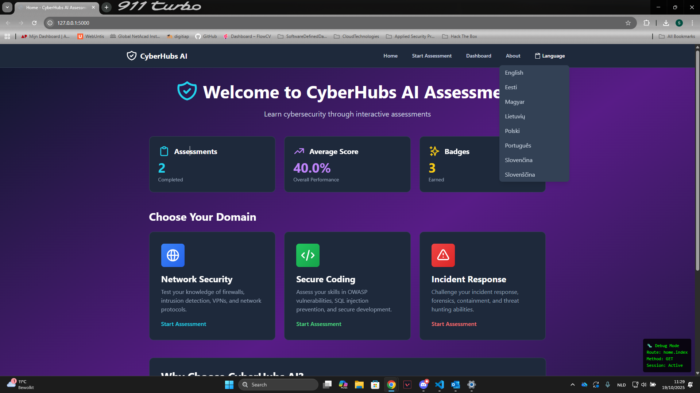

# CyberHubs AI Assessment Platform

A **cybersecurity skills assessment platform** built with Flask and powered by AI. Features hardcoded questions from JSON with AI-powered feedback and personalized recommendations.



---

## 🚀 Quick Start

### Prerequisites
- **Python 3.8+**
- **Google Gemini API key** ([Get one free](https://makersuite.google.com/app/apikey))
- **Git** (to clone repository)

### Installation (5 minutes)

```bash
# 1. Clone and navigate to project
cd prototype3

# 2. Create virtual environment
python -m venv venv
source venv/bin/activate          # On Windows: venv\Scripts\activate

# 3. Install dependencies
pip install -r requirements.txt

# 4. Create .env file
cp .env.example .env

# 5. Add your API key
# Edit .env and add:
# GOOGLE_API_KEY=your_api_key_here
# SECRET_KEY=your_secret_key_here

# 6. Run application
python app.py
```

### Access the Application
Open your browser and go to: **http://localhost:5000**

---

## ✨ Features

### Student Experience
- **3 Cybersecurity Domains**: Network Security, Secure Coding, Incident Response
- **3 Difficulty Levels**: Beginner, Intermediate, Advanced
- **Multiple Question Counts**: 5, 10, or 15 questions per assessment
- **Instant Feedback**: Get explanations immediately after answering
- **AI Summaries**: Personalized learning recommendations at the end
- **Progress Dashboard**: Track scores, history, and earn badges

### Technical Features
- **No API Rate Limiting**: All questions pre-loaded from JSON
- **Fast Performance**: No waiting for AI question generation
- **Offline Capable**: Works without internet (except for AI summaries)
- **Mobile-Friendly**: Responsive design for phones, tablets, and desktops
- **Dark Mode**: Professional dark theme with smooth animations
- **Multi-Language**: Support for 8 European languages

---

## 📁 Project Structure

```
prototype3/
├── app.py                          # Main Flask application
├── requirements.txt                # Python dependencies
├── .env.example                    # Environment template
├── questions.json                  # Hardcoded questions database
├── static/
│   ├── css/
│   │   └── custom.css             # Custom styling
│   └── translations.json          # Language translations
├── services/
│   ├── question_bank.py           # Load & manage questions
│   ├── gemini_service.py          # AI summaries & feedback
│   └── assessment_service.py      # Assessment logic & scoring
├── routes/
│   ├── home.py                    # Homepage & about page
│   ├── assessment.py              # Assessment flow
│   ├── dashboard.py               # User dashboard & stats
│   └── api.py                     # JSON API endpoints
└── templates/
    ├── base.html                  # Navigation & base layout
    ├── home.html                  # Landing page
    ├── assessment/
    │   ├── start.html            # Domain/difficulty selection
    │   ├── question.html         # Question display
    │   ├── feedback.html         # Answer feedback
    │   └── results.html          # Final results & AI summary
    ├── dashboard/
    │   ├── index.html            # Statistics dashboard
    │   ├── history.html          # Assessment history
    │   └── badges.html           # Earned badges
    └── errors/
        ├── 404.html              # Not found page
        └── 500.html              # Server error page
```

---

## 📊 How It Works

### Assessment Flow

1. **Select Domain & Difficulty**
   - Choose from 3 domains
   - Pick difficulty level (Beginner, Intermediate, Advanced)
   - Select question count (5, 10, or 15)

2. **Answer Questions**
   - Multiple-choice format (4 options)
   - Get instant feedback after each answer
   - Adaptive difficulty based on performance
   - Progress bar shows completion

3. **View Results**
   - Overall score and performance metrics
   - AI-powered personalized summary
   - Learning recommendations
   - Next suggested topics

4. **Track Progress**
   - Dashboard shows statistics
   - Assessment history
   - Badges for achievements
   - Performance trends

### Question Management

Questions are stored in `questions.json` with this structure:

```json
{
  "questions": {
    "network-security_beginner": [
      {
        "title": "Firewall Basics",
        "question": "Which statement best describes a firewall?",
        "domain": "network-security",
        "difficulty": "beginner",
        "options": [
          "A device that monitors network traffic",
          "Software that encrypts files",
          "Hardware for storage",
          "An antivirus program"
        ],
        "correct": 0,
        "explanation": "A firewall is a network security device...",
        "learningPoints": [
          "Firewalls act as barriers between networks",
          "Can be hardware or software-based"
        ]
      }
    ]
  },
  "metadata": {
    "version": "1.0",
    "total_questions": 900
  }
}
```

---

## 🔧 Configuration

### Environment Variables (.env)

```env
# Required - Get from https://makersuite.google.com/app/apikey
GOOGLE_API_KEY=your_api_key_here

# Required - Generate random secret key
SECRET_KEY=your_secret_key_here

# Optional
DEBUG=True                          # Enable debug mode
FLASK_ENV=development              # development or production
SESSION_TYPE=filesystem            # Session storage
```

### Available Domains

| Domain | Difficulty Levels | Questions |
|--------|------------------|-----------|
| Network Security | Beginner, Intermediate, Advanced | 300 |
| Secure Coding | Beginner, Intermediate, Advanced | 300 |
| Incident Response | Beginner, Intermediate, Advanced | 300 |

---

## 📦 Dependencies

The application requires the following Python packages (listed in `requirements.txt`):

| Package | Version | Purpose |
|---------|---------|---------|
| **Flask** | 3.0.0 | Web framework & routing |
| **Flask-Session** | 0.5.0 | Server-side session management |
| **Flask-Babel** | 4.0.1 | Internationalization & translations |
| **google-generativeai** | 0.3.2 | Google Gemini AI integration |
| **python-dotenv** | 1.0.0 | Environment variable management |
| **Requests** | 2.31.0 | HTTP library for API calls |
| **Werkzeug** | 3.0.1 | WSGI utilities & security |
| **Jinja2** | 3.1.2 | Template rendering engine |
| **MarkupSafe** | 2.1.3 | Safe string handling |

### Installation

All dependencies are automatically installed with:

```bash
pip install -r requirements.txt
```

---

## 🧪 Testing the Application

### Quick Verification

````
# Check if Flask is running
curl http://localhost:5000

# Test health endpoint
curl http://localhost:5000/api/health

# Count total questions
python -c "import json; d=json.load(open('questions.json')); print(f'Total questions: {sum(len(v) for v in d[\"questions\"].values())}')"
```

### Manual Testing Checklist

- [ ] Homepage loads correctly
- [ ] Can select domain and difficulty
- [ ] Questions display randomly
- [ ] Answers are recorded correctly
- [ ] AI summary generates at end
- [ ] Dashboard shows statistics
- [ ] Language switching works
- [ ] Mobile view is responsive
- [ ] Dark theme applies correctly
- [ ] History persists across sessions

---

## 🎨 UI/UX Features

### Responsive Design
- **Mobile**: Single column layout, hamburger menu
- **Tablet**: Two column layouts, optimized spacing
- **Desktop**: Three column layouts, full navigation

### Theme & Colors
- **Dark Mode**: Professional dark theme with cyan/blue accents
- **Dark Background**: `#1e293b` to `#1a1a2e` gradient
- **Accent Colors**: Cyan (`#06b6d4`), Blue (`#3b82f6`)
- **Text**: Light gray (`#e2e8f0`) for readability

### Accessibility
- Large touch targets (44px+ buttons)
- High contrast text
- Semantic HTML
- Keyboard navigation support
- Screen reader friendly

---

## 🌍 Multi-Language Support

Supported languages:
- English (en)
- Estonian (et)
- Hungarian (hu)
- Lithuanian (lt)
- Polish (pl)
- Portuguese (pt)
- Slovak (sk)
- Slovenian (sl)

Language selector in top navigation bar. Translations persist during session.

---

## 🐛 Troubleshooting

### Issue: Application won't start

**Error**: `ModuleNotFoundError: No module named 'flask'`
- **Solution**: Activate virtual environment and reinstall dependencies
  ```bash
  source venv/bin/activate  # On Windows: venv\Scripts\activate
  pip install -r requirements.txt
  ```

### Issue: "No API key" error

**Error**: `GOOGLE_API_KEY not found`
- **Solution**: Create `.env` file and add your API key (see Configuration section)
- **Get API Key**: Visit https://makersuite.google.com/app/apikey

### Issue: Questions not loading

**Error**: `questions.json not found`
- **Solution**: Ensure `questions.json` exists in the root directory
  ```bash
  python -c "import json; json.load(open('questions.json')); print('✅ Valid')"
  ```

### Issue: White screen on mobile

**Solution**: 
- Clear browser cache
- Try different browser
- Check browser console for errors (F12)
- Ensure CSS loads (check Network tab)

### Issue: AI summary not generating

**Solution**:
- Check internet connection (needed for Gemini API)
- Verify API key is correct in `.env`
- System shows basic summary as fallback
- Check logs: `tail logs/app.log`

---

## 📝 Development

### Adding New Questions

1. Edit `questions.json`
2. Add questions to appropriate `domain_difficulty` array
3. Follow exact JSON format (see example above)
4. Restart application: `python app.py`

### Updating Translations

1. Open `static/translations.json`
2. Find the language object (e.g., "pt" for Portuguese)
3. Update translation strings
4. Changes apply immediately without restart

### Enabling Debug Mode

```bash
# Set in .env file
DEBUG=True

# Then restart application
python app.py
```

**Debug features enabled:**
- Detailed error pages
- Auto-reload on code changes
- Verbose console logging
- Debug info in HTML templates

---

## 🏗️ Architecture Overview

### Service Layer
- **`question_bank.py`**: Loads questions from JSON, tracks used questions, random selection
- **`gemini_service.py`**: Generates AI summaries and learning recommendations
- **`assessment_service.py`**: Handles assessment flow, scoring, and adaptive difficulty

### Route Layer
- **`home.py`**: Homepage, about page, navigation
- **`assessment.py`**: Start assessment, question display, answer submission
- **`dashboard.py`**: User statistics, history, badges
- **`api.py`**: JSON endpoints for AJAX requests

### Data Flow
```
Request → Route → Service → Database (JSON) → Template → Response
  ↓
Session Storage (flask_session/)
```

---

## 📊 Performance

### Load Times
- **Page Load**: < 1 second
- **Question Display**: Instant (pre-loaded)
- **AI Summary**: 2-5 seconds (Gemini API)
- **Dashboard**: < 1 second

### Scalability
- Supports thousands of questions in JSON
- No database bottlenecks
- Efficient caching
- Minimal API calls (2 per assessment)

---

## 🔐 Security

- CSRF protection on all forms
- Secure session management
- Input validation on all endpoints
- XSS prevention in templates
- Safe API key handling (.env file)

---

## 📜 License

This project is part of the HackathonEU initiative.

---

## 🙏 Credits

- **Framework**: Flask (Python web framework)
- **AI**: Google Gemini API
- **UI**: Tailwind CSS
- **Icons**: Heroicons
- **Language**: Python 3.8+

---

## 📞 Support

### Common Commands

```bash
# Start application
python app.py

# Activate virtual environment
source venv/bin/activate          # macOS/Linux
venv\Scripts\activate             # Windows

# Install/update dependencies
pip install -r requirements.txt

# Run specific route test
curl http://localhost:5000/api/health

# View logs
tail -f logs/app.log
```

### Getting Help

1. **Check logs**: `cat logs/app.log`
2. **Browser console**: Press F12, check Console tab
3. **Enable debug mode**: Set `DEBUG=True` in `.env`
4. **Verify setup**: Check all `.env` variables are set

---

**Built for HackathonEU 2025** ✨

Start your assessment journey today! 🚀
